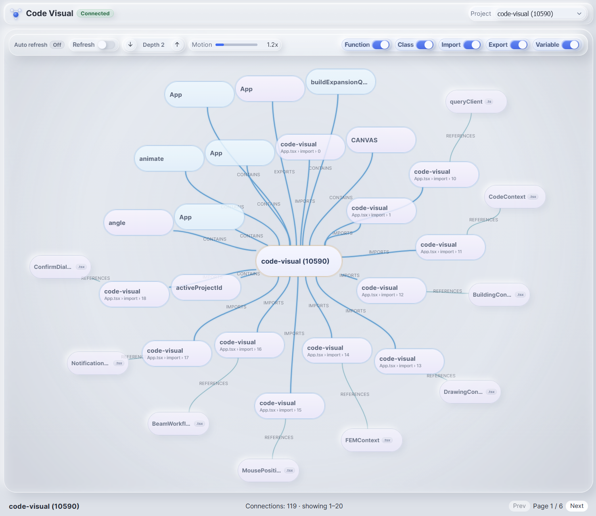

<div align="center">
  
  <h1>lxDIG Visual</h1>
  <p><strong>Interactive Code Graph Explorer · Codebase Visualization · Architecture Navigator</strong></p>
  <p>The visual layer of the <a href="https://github.com/lexCoder2/lxDIG-MCP">lxDIG</a> platform — see your code graph, explore dependencies, and navigate architecture interactively.</p>
</div>

<div align="center">

[](https://github.com/lexCoder2/lxDIG-MCP)
[](https://vitejs.dev)
[](https://react.dev)
[](https://www.typescriptlang.org)
[](https://memgraph.com)
[](https://d3js.org)
[](LICENSE)
[](QUICK_START.md)

</div>

<p align="center">
  
</p>

<p align="center"><strong>Stop RAGing. Start DIGging. And now — start <em>seeing</em>.</strong></p>

---

> **Part of the lxDIG ecosystem** — [lxDIG MCP](https://github.com/lexCoder2/lxDIG-MCP) builds the Dynamic Intelligence Graph. **lxDIG Visual** renders it as a live, navigable canvas so you can see, explore, and reason about your codebase's actual structure.

---

## Table of Contents

- [What is lxDIG Visual?](#what-is-lxdig-visual)
- [Why a visual graph explorer?](#why-a-visual-graph-explorer)
- [How it fits into lxDIG](#how-it-fits-into-lxdig)
- [Features](#features)
- [Screenshots](#screenshots)
- [Quick start](#quick-start)
- [Connect to lxDIG MCP](#connect-to-lxdig-mcp)
- [Who is this for?](#who-is-this-for)
- [Environment variables](#environment-variables)
- [Interaction guide](#interaction-guide)
- [Architecture](#architecture)
- [Scripts](#scripts)
- [Troubleshooting](#troubleshooting)
- [FAQ](#faq)
- [Contributing](#contributing)
- [Support the project](#support-the-project)
- [License](#license)

---

## What is lxDIG Visual?

**lxDIG Visual** is an open-source **interactive code graph explorer** and **codebase visualization tool** built on top of [lxDIG MCP](https://github.com/lexCoder2/lxDIG-MCP) — the Dynamic Intelligence Graph platform that gives AI coding assistants persistent memory, structural code reasoning, and multi-agent coordination.

When lxDIG MCP indexes your repository, it builds a queryable property graph of every file, function, class, import, and dependency relationship in your codebase. **lxDIG Visual takes that graph and renders it as a live, interactive canvas** — so developers, architects, and AI agents can see the actual topology of a project rather than guessing from folder trees and grep results.

**In one sentence:** lxDIG Visual is the browser-based graph UI for the lxDIG code intelligence platform — a real-time, explorable visualization of your codebase's dependency graph, architecture layers, and structural relationships.

### Key capabilities at a glance

- **Visualize code graphs** — render files, functions, classes, and their relationships as an interactive force-directed graph
- **Explore dependencies interactively** — double-click any node to expand its neighborhood and reveal imports, call edges, and dependents
- **Navigate large codebases** — pan, zoom, drag, and drill into any region of interest with smooth, responsive rendering
- **Understand architecture** — see layer boundaries, module clusters, and cross-cutting concerns that are invisible in editors
- **Live + mock modes** — connect to a running lxDIG MCP instance for real graph data, or use built-in mock data for local development

---

## Why a visual graph explorer?

Text-based code intelligence tools (RAG, grep, file trees) answer *what* is in a file. A code graph visualization answers *how everything connects*.

| Question | Traditional tools | lxDIG Visual |
| -------- | ----------------- | ------------ |
| What does this module depend on? | Manual grep + file reads | Expand the node — all edges visible instantly |
| Which files are most central to this feature? | Heuristic guessing | PageRank-weighted graph centrality, visible at a glance |
| Are there circular dependencies? | Static analysis tools (separate install) | Graph cycles are visible as closed loops on the canvas |
| What would break if I change this file? | `git log` + guesswork | Follow the incoming call edges on the graph |
| How are my architecture layers organized? | Docs and conventions | Color-coded layer nodes in the live graph |
| Where does this agent get its context? | Read the MCP tool list | Explore the graph the agent is actually querying |

The goal isn't to replace lxDIG MCP's query tools — it's to make the underlying graph **tangible and explorable** for the humans working alongside AI agents.

---

## How it fits into lxDIG

```
┌─────────────────────────────────────────────────────────────────────┐
│                       lxDIG Platform                                 │
│                                                                      │
│  ┌───────────────────────────┐     ┌───────────────────────────┐    │
│  │  lxDIG MCP                │     │  lxDIG Visual (this repo)  │    │
│  │  ─────────────────────── │     │  ─────────────────────────  │    │
│  │  39 MCP tools             │     │  Interactive graph canvas   │    │
│  │  Code graph + vectors     │────▶│  Expand-by-depth explorer  │    │
│  │  Agent memory + coord.    │     │  Architecture visualization │    │
│  │  Test intelligence        │     │  Live + mock data modes     │    │
│  │  Multi-agent coordination │     │  Real-time graph updates    │    │
│  └───────────────────────────┘     └───────────────────────────┘    │
│               │                                │                     │
│               ▼                                ▼                     │
│  ┌────────────────────────────────────────────────────┐             │
│  │              Memgraph (shared graph database)        │             │
│  └────────────────────────────────────────────────────┘             │
└─────────────────────────────────────────────────────────────────────┘
```

Both tools share the same **Memgraph** instance. lxDIG MCP writes the graph (via `graph_rebuild`, `episode_add`, `impact_analyze`). lxDIG Visual reads and renders it. **Every change the MCP server makes is immediately visible in the visual explorer** — no manual refresh, no separate indexing step.

This means:
- After `graph_rebuild` runs in your AI assistant, lxDIG Visual shows the updated graph
- After `impact_analyze` runs, you can explore the affected dependency subgraph visually
- While agents coordinate via `agent_claim`/`agent_release`, you can watch the coordination graph in real time

---

## Features

### Interactive code graph visualization

- **Force-directed layout** — physics-based graph positioning that naturally clusters related code
- **Expand-by-depth** — progressively reveal graph structure by expanding nodes to configurable depth levels
- **Neighborhood exploration** — double-click any node to pull in its direct relationships (imports, calls, dependencies)
- **Node selection and inspection** — click to select, view properties, and understand a node's role in the architecture
- **Pan, zoom, drag** — navigate large graphs fluidly with smooth, responsive rendering

### Architecture and structure visualization

- **Layer-aware rendering** — files, functions, classes, and architecture layers are visually distinct by node type
- **Semantic rendering** — relationship types (import, call, dependency) have distinct visual treatments
- **Cluster visualization** — natural graph clusters surface module boundaries and feature groupings
- **Architecture layer boundaries** — see the layer topology that lxDIG MCP validates and enforces

### Developer experience

- **Live mode** — connects directly to Memgraph through a lightweight Node.js proxy for real, up-to-date graph data
- **Mock mode** — built-in fallback with sample data for resilient local development without a running database
- **Worker-assisted layout** — force simulation runs off the main thread so the UI stays responsive even on large graphs
- **Incremental layout** — adding new nodes doesn't reset the entire layout; existing positions remain stable
- **Hot reload** — Vite dev server with instant HMR for rapid UI iteration

### Tech stack

Built with modern, well-supported open source tools:

| Layer | Technology | Purpose |
| ----- | ---------- | ------- |
| Frontend | React 19 + TypeScript 5 | Component tree, state, UI |
| Bundler | Vite 8 | Dev server, HMR, production builds |
| State | Zustand + Immer | Immutable graph state with subscriptions |
| Layout | D3 force simulation + Web Worker | Physics-based node positioning, off-thread |
| Graph DB | Memgraph (shared with lxDIG MCP) | Source of truth for graph data |
| Transport | Neo4j Bolt driver → local proxy | Secure, proxied Memgraph queries |

---

## Screenshots

<p align="center">
  
</p>

<p align="center">
  
</p>

---

## Quick start

### Prerequisites

| Requirement | Version | Notes |
| ----------- | ------- | ----- |
| Node.js | 18+ | 20+ recommended |
| Memgraph | Running | Via Docker (see lxDIG MCP setup) or native |

> **Tip:** If you're using the full lxDIG stack, Memgraph is already running from the [lxDIG MCP setup](https://github.com/lexCoder2/lxDIG-MCP/blob/main/QUICK_START.md). You only need to start lxDIG Visual.

### Install and run

```bash
git clone https://github.com/lexCoder2/lexRAG-visual.git
cd lexRAG-visual
npm install
cp .env.example .env
npm run dev:all
```

Open [http://localhost:5173](http://localhost:5173) — the graph canvas loads immediately.

`dev:all` starts both the Memgraph proxy server and the Vite dev server concurrently. If Memgraph isn't reachable, the app automatically falls back to mock data so you can still explore the UI.

---

## Connect to lxDIG MCP

For a fully populated code graph, run lxDIG Visual alongside a running and indexed [lxDIG MCP](https://github.com/lexCoder2/lxDIG-MCP) instance:

**Step 1 — Set up lxDIG MCP**

Follow the [Quick Start guide](https://github.com/lexCoder2/lxDIG-MCP/blob/main/QUICK_START.md) — Docker + one command setup, under 5 minutes. This starts Memgraph, Qdrant, and the MCP server.

**Step 2 — Index your project**

Through your AI assistant (Claude Code, VS Code Copilot, Cursor), call:

```json
{
  "name": "init_project_setup",
  "arguments": {
    "workspaceRoot": "/path/to/your-project",
    "sourceDir": "src",
    "projectId": "my-repo"
  }
}
```

This builds the full code graph — files, functions, classes, imports, call edges, architecture layers.

**Step 3 — Point lxDIG Visual to the same Memgraph**

In your `.env`, set:

```env
MEMGRAPH_BOLT_URL=bolt://localhost:7687
```

**Step 4 — Start lxDIG Visual**

```bash
npm run dev:all
```

The canvas will render the complete indexed graph. Every subsequent `graph_rebuild` or `impact_analyze` call your agent makes will be reflected live.

---

## Who is this for?

### Individual developers using AI coding assistants

You use Claude Code, VS Code Copilot, or Cursor with lxDIG MCP. lxDIG Visual gives you a live window into the graph your AI agent is querying — so you can understand what your agent knows about your codebase, verify that the graph is accurate, and explore structural relationships yourself.

### Software architects and tech leads

Use lxDIG Visual to visualize architecture layer compliance, spot unexpected cross-layer dependencies, identify circular dependency chains, and understand how modules cluster. It's the difference between reading about your architecture and *seeing* it.

### Engineering teams running multi-agent workflows

When multiple AI agents are working in parallel on the same repository via lxDIG MCP's `agent_claim`/`agent_release` coordination protocol, lxDIG Visual provides a real-time view of what the graph looks like — which nodes are claimed, what edges have changed, and where the agents are working.

### Developers onboarding to new codebases

Instead of reading file trees and grep results, open lxDIG Visual on an indexed repository and explore the dependency graph interactively. Follow imports, trace call chains, and understand module boundaries in minutes rather than hours.

---

## Environment variables

Configure via `.env` (copy from `.env.example`):

| Variable | Default | Description |
| -------- | ------- | ----------- |
| `VITE_MEMGRAPH_URL` | `http://localhost:4000/query` | Frontend query endpoint (via proxy) |
| `MEMGRAPH_BOLT_URL` | `bolt://localhost:7687` | Proxy → Memgraph Bolt connection |
| `MEMGRAPH_BOLT_USER` | _(empty)_ | Bolt authentication username |
| `MEMGRAPH_BOLT_PASSWORD` | _(empty)_ | Bolt authentication password |
| `MEMGRAPH_PROXY_PORT` | `4000` | Local proxy server port |
| `VITE_MEMGRAPH_SCHEMA_MODE` | `full` | Schema mode: `full` (recommended) or `legacy` |

---

## Interaction guide

| Action | Input | Result |
| ------ | ----- | ------ |
| **Pan** | Right-drag on canvas | Move the viewport |
| **Zoom** | Mouse wheel | Zoom centered on pointer position |
| **Select node** | Click on a node | Highlight and show node details panel |
| **Expand neighbors** | Double-click on a node | Pull in connected nodes (imports, calls, dependents) |
| **Reposition** | Drag a node | Move node and adjust local layout |
| **Inspect edge** | Hover over an edge | Show relationship type and metadata |

---

## Architecture

```
Memgraph (Bolt, port 7687)
    │
    ▼
Proxy server (Express, port 4000)   ← bridges browser → Bolt
    │
    ▼
Graph store (Zustand + Immer)        ← immutable graph state
    │
    ▼
Layout engine (D3 force + Web Worker) ← physics off main thread
    │
    ▼
React canvas (GraphCanvas + EdgeCanvas + NodeViewer)
```

For a deep architectural walkthrough, see [docs/architecture.md](docs/architecture.md) and [docs/performance-plan.md](docs/performance-plan.md).

---

## Scripts

| Command | Description |
| ------- | ----------- |
| `npm run dev` | Vite dev server only (no proxy) |
| `npm run proxy` | Memgraph proxy server only |
| `npm run dev:all` | Proxy + frontend concurrently (recommended) |
| `npm run build` | TypeScript check + Vite production build |
| `npm run lint` | ESLint |
| `npm run preview` | Preview production build locally |

---

## Troubleshooting

| Problem | Cause | Fix |
| ------- | ----- | --- |
| Empty or disconnected graph | Memgraph not running or not indexed | Start Memgraph via Docker, run `graph_rebuild` through lxDIG MCP |
| Proxy / CORS errors | Proxy not started | Use `npm run dev:all` instead of `npm run dev` |
| Mock data shows instead of real graph | Memgraph unreachable | Verify `MEMGRAPH_BOLT_URL` in `.env` and that Memgraph is healthy |
| Slow interaction on dense graphs | Too many visible nodes | Reduce expand depth or narrow the visible scope |
| Build fails | Missing dependencies | Run `npm install`, then `npm run build` |
| Nodes appear with no labels | Schema mode mismatch | Try `VITE_MEMGRAPH_SCHEMA_MODE=legacy` in `.env` |

---

## FAQ

**Q: Do I need lxDIG MCP to use lxDIG Visual?**
No — lxDIG Visual ships with built-in mock data and works out of the box without any backend. But to visualize your own codebase, you need a running lxDIG MCP instance with a populated Memgraph. The mock mode is for UI exploration and development.

**Q: What graph databases are supported?**
lxDIG Visual connects to [Memgraph](https://memgraph.com) via the Bolt protocol. Because it uses the Neo4j driver, it is also compatible with Neo4j. Memgraph is recommended for its performance with graph analytics workloads and its compatibility with the lxDIG MCP stack.

**Q: How large a codebase can it visualize?**
The graph rendering is performant for hundreds to a few thousand visible nodes. For large monorepos with millions of nodes, use expand-by-depth to navigate incrementally — load a root node and expand only the neighborhoods you need rather than rendering the whole graph at once.

**Q: Can I use lxDIG Visual without the rest of the lxDIG stack?**
Yes — if you already have a Memgraph instance with a property graph of your code (from any source, not just lxDIG MCP), lxDIG Visual can connect and render it. The node type schema matches the lxDIG MCP graph model, but the proxy accepts any valid Cypher queries.

**Q: Is there a hosted / cloud version?**
Not yet. lxDIG Visual is fully self-hosted today. lxDIG Cloud (zero-infrastructure, hosted) is on the [lxDIG roadmap](https://github.com/lexCoder2/lxDIG-MCP#roadmap).

**Q: What's the relationship between lxDIG Visual and lxDIG MCP?**
lxDIG MCP is the intelligence engine — it indexes code, answers graph queries, manages agent memory, and coordinates multi-agent workflows. lxDIG Visual is a read-only display layer that renders the same Memgraph database as a navigable canvas. They complement each other: the MCP gives agents structured answers; the visual gives humans spatial understanding.

---

## Contributing

Contributions are welcome — bug fixes, new visualization features, UI improvements, performance work, and documentation all move this project forward.

- **Issues** — [open an issue](https://github.com/lexCoder2/lexRAG-visual/issues) to report bugs or request features
- **Pull requests** — fork, branch off `main`, and submit a PR with a clear description of what changed and why
- **UI features** — new graph views, layout options, and node type renderers are high-value contributions
- **Docs** — typos, clarifications, and better examples are always welcome

This project follows the conventions and architecture patterns of the broader [lxDIG ecosystem](https://github.com/lexCoder2/lxDIG-MCP).

---

## Support the project

lxDIG is built and maintained in personal time — designing the graph model, writing the rendering engine, integrating with Memgraph, and keeping the stack current. If lxDIG Visual makes your codebase exploration easier or your AI-assisted workflows more transparent, consider supporting the work:

- **GitHub Sponsors** → [github.com/sponsors/lexCoder2](https://github.com/sponsors/lexCoder2)
- **Buy Me a Coffee** → [buymeacoffee.com/hi8g](https://buymeacoffee.com/hi8g)

---

## License

[MIT](LICENSE) — free to use, modify, and distribute.

---

<div align="center">
  <sub>
    Part of the <a href="https://github.com/lexCoder2/lxDIG-MCP">lxDIG</a> ecosystem ·
    See your code graph, don't just query it ·
    <a href="https://github.com/lexCoder2/lxDIG-MCP">lxDIG MCP</a> ·
    <a href="https://github.com/lexCoder2/lexRAG-visual/issues">Issues</a>
  </sub>
</div>
